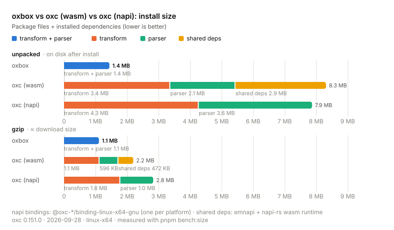
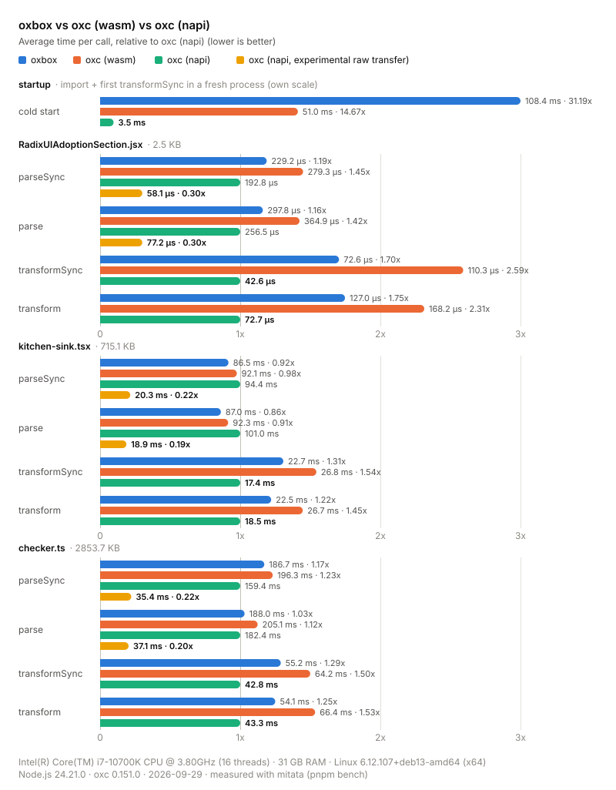

# oxbox

## Usage

Same API as [oxc-transform](https://www.npmjs.com/package/oxc-transform) and [oxc-parser](https://www.npmjs.com/package/oxc-parser) (`parse`, `parseSync`), backed by an embedded wasm binary built from oxc sources (no native binaries, no runtime dependencies):

```js
import { parseSync, transformSync } from "oxbox";

const { code } = transformSync("input.ts", "const a: number = 1");
const { program } = parseSync("input.ts", "const a: number = 1");
```

The wasm is embedded in the JS bundle (deflate-raw + base93) and decoded, decompressed and instantiated lazily on first call. Use `await init()` to warm it up ahead of time (required before calling sync APIs in browsers).

Async APIs run on worker threads when `SharedArrayBuffer` is available (in browsers the page must be [cross-origin isolated](https://developer.mozilla.org/en-US/docs/Web/API/Window/crossOriginIsolated)); otherwise oxbox runs single-threaded and async APIs run on the calling thread.

## Benchmarks

Compared with the official [oxc-transform](https://www.npmjs.com/package/oxc-transform) / [oxc-parser](https://www.npmjs.com/package/oxc-parser) wasm and native (napi) bindings.

### Install size



oxbox ships transform and parser as a single wasm; oxc ships them as two packages (and the wasm bindings share the emnapi / napi-rs runtime).

### Performance



## Development

<details>

<summary>local development</summary>

- Clone this repository
- Install latest LTS version of [Node.js](https://nodejs.org/en/)
- Enable [Corepack](https://github.com/nodejs/corepack) using `corepack enable`
- Install dependencies using `pnpm install`
- Run the browser playground using `pnpm dev`
- Run tests using `pnpm vitest`
- Run benchmarks against `oxc-transform` / `oxc-parser` (napi and wasm) using `pnpm bench [filter]` (unfiltered runs save `bench/results.json`; `pnpm bench:report` re-renders `bench/results.svg` from it) and install sizes using `pnpm bench:size` (renders `bench/size.svg`)
- Rebuild the wasm from oxc sources (committed as `src/_vendor/wasm.ts`) using `pnpm vendor` (requires Rust and `rustup target add wasm32-wasip1-threads`)

</details>

## License

Published under the [MIT](./LICENSE) license 💛.

Bundles [oxc](https://github.com/oxc-project/oxc) (MIT, VoidZero Inc. & Contributors). The N-API / WASI host (`src/napi.ts`) is derived from [emnapi](https://github.com/toyobayashi/emnapi) (MIT, Toyobayashi) and the [napi-rs](https://github.com/napi-rs/napi-rs) wasm runtime (MIT, LongYinan). See [LICENSE](./LICENSE) for full license texts.
